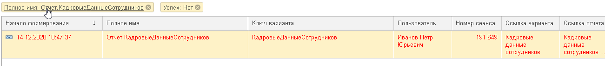

# Внедрение

Подсистема «**История формирования отчетов**» (далее ИФО) сохраняет информацию о выполнениях отчетов пользователями: длительность, используемые настройки, описание ошибки и т.д.

Предоставляет возможность применять используемые ранее настройки отчета, сохранять возникающие ошибки и выявлять настройки, приводящие к долгому выполнению отчета.

Расширение внедряется в стандартный код формирования отчетов БСП и общую форму отчета. Но можно вызовать методы вручную, если какой-то отчет отличается от типового подхода БСП.

## Что дает подсистема?

- **Пользователям** - интерфейс, который позволит "откатиться" к прежним настройкам отчета, а так же делиться ими без сохранения в качестве отдельного варианта.
- **Администраторам** - подсистему для контроля скорости выполнение отчетов и проблем по ним.
- **Разработчикам** - механизм, который позволяет выполнять отчет с такими же настройками, что были у пользователя.

# Установка

Необходимо установить расширение как указано на скриншоте

# Настройка

Настройка происходит в регистре сведений по навигационной ссылке:  
`e1cib/list/РегистрСведений.ИТМ_НастройкиИсторииФормированияОтчетов`

Настройки подсистемы ведутся в разрезе отчетов. То есть, каждому отчету можно задать свои собственные настройки. Если не задавать, то будут применяться "общие".

На данный момент подсистема не включена. В таком виде база будет работать как всегда и история фиксироваться не будет. Давайте включим подсистему. Для этого нажмём в общих настройках "Фиксировать историю".

Теперь по всем отчетам всегда будет фиксироваться история.

Но что если нет необходимости писать историю какого-то отчета? Для этого можно просто сделать для него отдельную настройку. К примеру, отключим историю для "Движения документа". Это простой контекстный отчёт и нам отслеживать его нет смысла.

Нажмём "Добавить" и выберем в списке отчет "Движения документа". В настройки подсистемы добавлена новая запись. Проверим, что снят флажок "Фиксировать историю".

Теперь подсистема будет фиксировать все отчеты, кроме "Движения документа".

Но что, если нам не нужно вообще хранить каждое выполнение отчётов? Допустим, что есть смысл хранить только те настройки отчётов, которые привели к ошибке выполнения. Для этого необходимо воспользоваться настройкой отборов.

Активируем строку с общими настройками и нажмём на выбор отборов.

Настройка отборов базируется на СКД. Вот доступные "из коробки" поля для отборов.

Примеры настроек:

- Фиксируем только ошибочное выполнение:  

- Фиксируем выполнение, которое медленнее указанного в ключевой операции времени:  

- Фиксируем только выполнения пользователей из списка:  

И так далее. Так же есть возможность добавления дополнительных пользовательских полей:  

Сейчас мы сделаем простую настройку. История будет фиксироваться только под этими пользователем "Орлов АВ" (Администратор демо-базы ERP).

Отборы будут учитываться только когда включен флаг "Собственные отборы". Допустим, что вы решили отказаться от отборов на какое-то время. Вам нет необходимости удалять отборы. Достаточно снять флаг. А потом, как понадобится, включить снова.

Всё, на данный момент у нас будет фиксироваться история всех отчётов только по Орлову. При этом по "Движения документа" история отключена.

Давайте укажем ещё один пример настройки подсистемы. Предположим, что "Универсальный отчёт" должен хранить историю по всем пользователям. То есть для него необходимо "отменить" использование общих отборов. Для этого можно добавить нашему отчёту настройку и установить флаг "Собственные отборы". Всё, уже на этом этапе отчет больше не смотрит на общие отборы и ему можно установить свои. Или не указывать - тогда история будет писаться по нему всегда.

## Права доступа

По умолчанию только у администраторов есть доступ к настройке и просмотру истории отчетов. Но пишется история под любым пользователем (в соответствии с настройками подсистемы).

Но можно настроить более гибко. Для этого в составе подсистемы есть роли:

- **Просмотр своей истории формирования отчетов** - позволяет смотреть только свою историю формирования
- **Просмотр всей истории формирования отчетов** - позволяет смотреть историю формирования всех пользователей
- **Анализ истории формирования отчетов** - позволяет формировать одноименный отчет для анализа истории
- **Администратор истории формирования отчетов** - позволяет изменять настройки подсистемы, а так же выгружать и загружать записи истории из базы.
Эти роли можно выдавать разным пользователям. Вот пример настройки для демо-базы ERP:

Для начала создадим профили доступа на каждую роль подсистемы

В каждом профиле указывается только одноименная роль:

По такому же принципу создадим и группы доступа

Теперь в каждую группу можно добавлять пользователей. Например, дадим право просмотра своей истории Кислову Артему Сергеевичу (демо-кладовщик)

После перезахода в базу этот пользователь сможет смотреть историю по себе.

Подобным образом можно использовать и роль просмотра всей истории и роль администрирования.

# Использование

Как только настройка подсистемы завершена, у всех пользователей (которым доступен просмотр истории) в типовой форме отчета появляется соответствующая кнопка

После чего открывается форма выбора настроек с которыми формировали этот вариант отчета.

В этой форме можно выбрать записи истории формирования отчетов и настройки из них автоматически загрузятся.

- **Выбрать** - Применить настройки из истории
- **Только мои** - Показывать только историю текущего пользователя. Кнопку можно "отключить", если есть право администрирования или просмотра всей истории.
- **Выгрузить в файл** - Выгрузить выбранные записи истории в файл. Позволяет сохранять записи в формате XML, чтобы потом использовать для анализа на копии. Кнопка доступна только администратору.
- **Загрузить из файла** - Загрузить записи истории из файла. Читает файл, который был создан по кнопке "Выгрузить в файл". Кнопка доступна только администратору.

Отображаемые колонки:

- **Начало** - Начало формирования отчета с настройками
- **Пользователь** - Пользователь, который формировал отчет
- **Длительность** - Сколько времени формировался отчет
- **Текст ошибки** - По какой причине отчет не удалось сформировать
- **Успех** - Удалось ли сформировать отчет
- **Комментарий** - Комментарий к записи истории, установленный вручную. Доступна для редактирования администратору подсистемы.

Помимо вызова из формы самого отчета, можно перейти в сам регистр и увидеть там полный набор записей:  
`e1cib/list/РегистрСведений.ИТМ_ИсторияФормированияОтчетов`

В общей форме списка состав колонок шире

Из общей формы списка можно сразу же открыть отчет по соответствующей кнопке. Откроется вариант отчета с установленными настройками из записи истории.

В любой записи истории можно установить произвольный комментарий.

Для удобства не забывайте пользоваться навигационными ссылками. Таким образом можно пересылать друг другу ссылки на нужные записи

Для анализа накопленных данных в подсистеме есть свой отчет "Анализ истории формирования отчетов".

Встроенный вариант "Количество ошибок за день":

Вариант "Различные ошибки":

На его базе можно собрать любые необходимые варианты.

# Разработка

Для удобства доработки подсистемы под свои нужды добавлены переопределяемые модуль. В них вынесены процедуры и функции для гибкого управления логикой механизмов. Методы прокоментированы с примерами использования.

Подсистему можно использовать и не только в отчетах, которые используют типовую форму БСП. Для фиксирования истории по любым отчетам можно воспользоваться методами, которые находятся в области `ЗамерПроизвольногоОтчета` модуля `ИТМ_ИсторияФормированияОтчетов`

Для выноса кнопки на форму нетипового отчета можно использовать метод `ИТМ_ИсторияФормированияОтчетов.ФормаОтчета_ПриСозданииНаСервере()`. В составе дополнительных параметров можно передать имя командной панели, в которой необходимо разместить кнопку.

# Разбор ошибок формирования отчетов

Рассмотрим кейс, когда к вам пришел инцидент, что какой-то из отчетов формируется с ошибкой и вам нужно определить порядок воспроизведения ошибки, чтобы подтвердить существование проблемы и затем поставить запрос на исправление ошибки.

Рассмотрим реальный пример на основании данных отчета "Анализ истории формирования отчетов", вариант "Анализ истории формирования отчетов (Количество ошибок за день)" за период 14 декабря в базе КИС ГКЦ.

Отчет показывает следующие данные:

На скриншоте видно, что за 14 декабря 9 раз формирование отчетов падало по ошибке. Попробуем воспроизвести ошибку в отчете "Отчет.КадровыеДанныеСотрудников":

1. Открываем форму регистра сведений "История формирования отчетов", убираем отбор "Только мои"  

2. Делаем следующий отбор:  
Полное имя - Отчет.КадровыеДанныеСотрудников  
Успех - Нет  
Видим запись формирования отчета, когда он упал с ошибкой:  

3. Позиционируемся на данной строке регистра сведений и нажимаем кнопку "Открыть отчет"

4. Открылась форма отчета "Кадровые данные сотрудников" и в нее автоматически подтянулись те же самые настройки, с которыми формирование отчета у пользователя "Иванов Петр Юрьевич" завершилось ошибкой. Сформируем отчет.  

5. Как видим у нас отчет сформировался без ошибок, а это в скорее всего значит, что дело в правах пользователя и у него не хватает прав на одну из таблиц запроса.

6. Смотрим по данному регистру сведений формировался ли этот отчет без ошибок у других пользователей, и если да, то разбираемся в правах пользователей, чтобы выяснить в чем разница между ними.

Это был один конкретный случай и найдена причина проблемы, но нужно действовать по ситуации.

## Заключение

Если вам интересен проект, то не пожалейте поставить "звездочку" =)

По всем вопросам можете обращаться к разработчику [@Черненко Виталий](https://github.com/SeiOkami)
